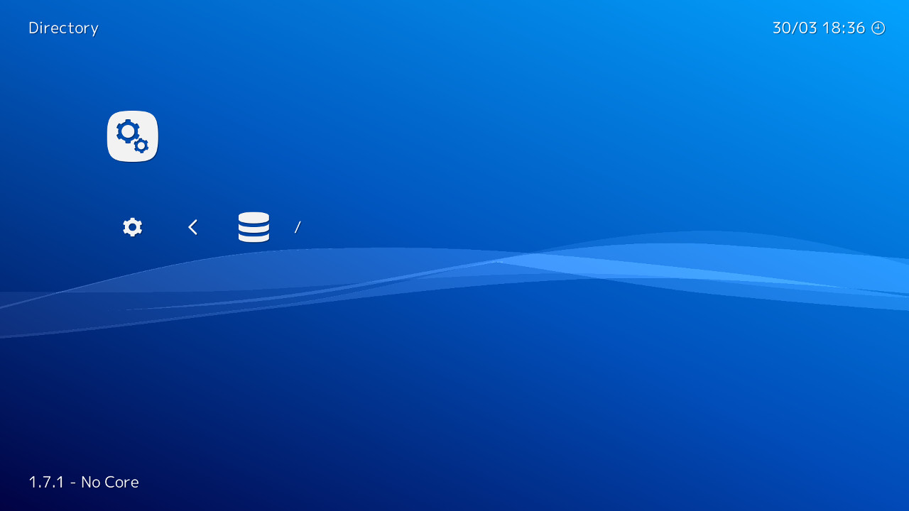
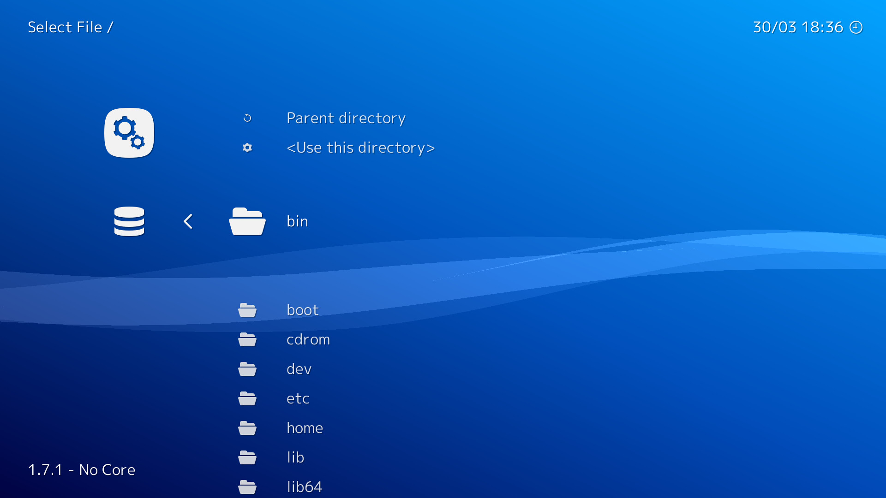

# File Browser

For this part of the setup guide we will be teaching you how to use RetroArch's file browser. The browser is rather basic, although it isn't too hard to get used to it.

## Change default directory

To make your content easier to get to, you should change the default directory. This would be a good first use of the file browser.

Move to the settings tab then find **Directory**, then move to **File Browser**. 

The first screen should show the storage devices move to the one that contain your game content and press enter.

!!! note
    On Windows it will display drive letters (like C:/ and D:/), However a system like Linux doesn't work in the same way and will only display the root. Most Android users should select */storage/emulated/0* if they want internal storage.

You have now entered the main part of the file browser. Beneath the first two options will be all your folders. Navigate your file system until you are inside your content folder then select **"<Use this directory>"**.

!!! tip
    On GNU/Linux, other hard drives are usually stored under */media/* or */mnt/*.

You should now be back in the settings menu with the *File browser* set to the folder you wanted.
