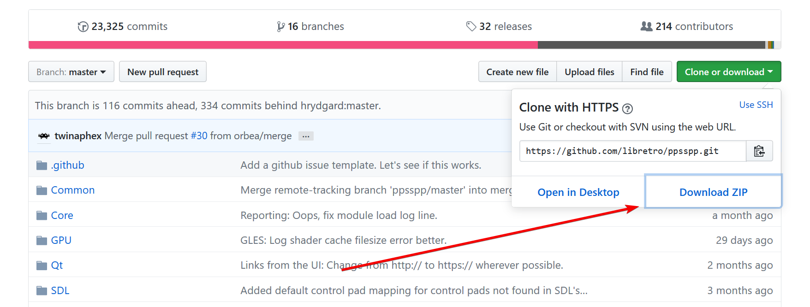
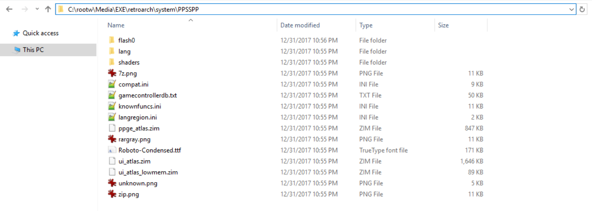
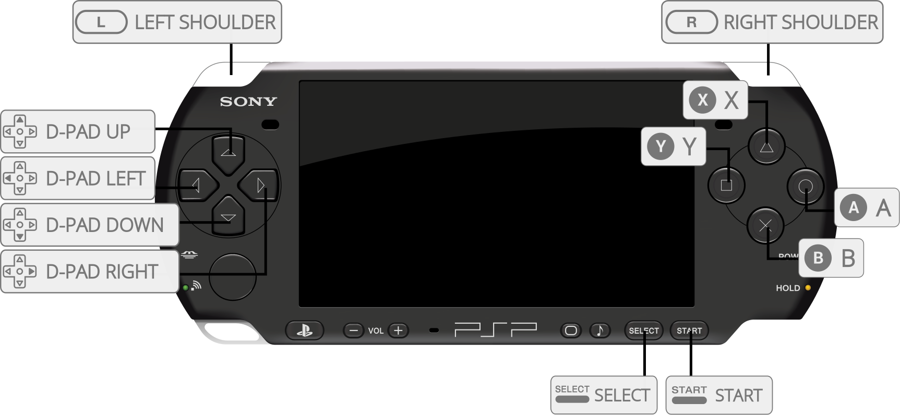

# Sony - PlayStation Portable (PPSSPP)

## Background

A PSP emulator for Android, Windows, Mac and Linux, written in C++

The PPSPP core supports [OpenGL](https://docs.libretro.com/library/ppsspp/#opengl), [Vulkan](https://docs.libretro.com/library/ppsspp/#vulkan), and [Direct3D 11](https://docs.libretro.com/library/ppsspp/#d3d11) rendering.

The PPSSPP core has been authored by

- Henrik Hrydgard

The PPSSPP core is licensed under

- [GPLv2](https://github.com/hrydgard/ppsspp/blob/master/LICENSE.TXT)

A summary of the licenses behind RetroArch and its cores have found [here](https://docs.libretro.com/tech/licenses/).

## BIOS

The PPSSPP core requires assets files to be fully functional. 

Assets such as fonts and backgrounds that are required for memory card screens.

In order to acquire PPSSPP's assets files and install them succcessfully, follow these steps.

1 . Create a directory named PPSSPP in RetroArch's System directory.

```
RetroArch/
         └── system/
		   └── PPSSPP/
```

Here's an example of what it should look like.


2 . Visit [https://github.com/hrydgard/ppsspp](https://github.com/hrydgard/ppsspp) and download the repository.



3 . Extract ppsspp-master.zip

4 . Copy the contents of `ppsspp-master/assets` into 'system/PPSSPP'

The end result should look like this.



!!! attention
	Don't like PPSSPP's replacement fonts? You can place the original PSP fonts in 'system/PPSSPP/flash0/font'

## Extensions

Content that can be loaded by the PPSPP core have the following file extensions:

- .elf
- .iso
- .cso
- .prx
- .pbp

RetroArch database(s) that are associated with the PPSPP core:

- [Sony - PlayStation Portable](https://github.com/libretro/libretro-database/blob/master/rdb/Sony%20-%20PlayStation%20Portable.rdb)

## Features

Frontend-level settings or features that the PPSSPP core respects.

| Feature           | Supported |
|-------------------|:---------:|
| Restart           | ✔         |
| Screenshots       | ✔         |
| Saves             | ✔         |
| States            | ✔         |
| Rewind            | ✔         |
| Netplay           | ✕         |
| Core Options      | ✔         |
| RetroAchievements | ✕         |
| RetroArch Cheats  | ✕         |
| Native Cheats     | ✕         |
| Controls          | ✔         |
| Remapping         | ✔         |
| Multi-Mouse       | ✕         |
| Rumble            | ✕         |
| Sensors           | ✕         |
| Camera            | ✕         |
| Location          | ✕         |
| Subsystem         | ✕         |
| [Softpatching](https://docs.libretro.com/guides/softpatching/) | ✕         |
| Disk Control      | ✕         |
| Username          | ✔         |
| Language          | ✔         |
| Crop Overscan     | ✕         |
| LEDs              | ✕         |

### Directories

The PPSSPP core's library name is 'PPSSPP'

The PPSSPP core saves/loads to/from these directories.

**Frontend's Save directory**

```
.
└── PSP/
       ├── PPSSPP_STATE/ (Used to be the state directory, no longer used)
       ├── SAVEDATA/ (Game memory stick directories and files)
       ├── Cheats/ (Internal Cheats directory, disabled by default)
       ├── GAME/ (DLC directory)
       └── SYSTEM/
                 └── CACHE/ (Shader cache)
```

**Frontend's State directory**

| File     | Description |
|:--------:|:-----------:|
| *.state# | State       |

### Geometry and timing

- The PPSSPP core's core provided FPS is 60
- The PPSSPP core's core provided sample rate is 44100 Hz
- The PPSSPP core's base width is dependent on the 'Internal Resolution' core option
- The PPSSPP core's base height is dependent on the 'Internal Resolution' core option
- The PPSSPP core's max width is dependent on the 'Internal Resolution' core option
- The PPSSPP core's max height is dependent on the 'Internal Resolution' core option
- The PPSSPP core's core provided aspect ratio is 16/9

## Internal Cheats

Disabled by default.

**To enable and allow the use of ini cheat files in save\PSP\Cheats, set the 'Internal Cheats Support' core option to enabled.**

Cheats can be used to unlock 60fps in several 30fps games.

Each code can be activated or disabled in the ini directly with _C1 in place of _C0 on the title line.

[PPSSPP forums thread](http://forums.ppsspp.org/showthread.php?tid=3590)

## DLC

DLCs need to be installed in the GAME directory. Create the GAME directory in the PSP directory and it should look like this.

RetroArch\saves\PPSSPP\PSP\GAME\

## OpenGL

PPSSPP's OpenGL renderer can be used by setting RetroArch's video driver to gl.

## Vulkan

PPSSPP's Vulkan renderer can be used by setting RetroArch's video driver to vulkan.

## D3D11

PPSSPP's Direct3D 11 renderer can be used by setting RetroArch's video driver to d3d11.

## Core options

The PPSSPP core has the following option(s) that can be tweaked from the core options menu. The default setting is bolded. 

Settings with (Restart) means that core has to be closed for the new setting to be applied on next launch.

- **CPU Core** [ppsspp_cpu_core] (**jit**|IR jit|interpreter)

    The jit setting enables the Dynamic Recomplier (Dynarec) for CPU emulation. The Dynarec is much faster than the interpreter setting and is the default, recommended mode for supported architectures.
 
    The interpreter setting enables the Interpreter for CPU emulation. The Interpreter is a very slow type of emulation and mostly useful for debug, but should work anywhere.
	
- **Locked CPU Speed** [ppsspp_locked_cpu_speed] (**off**|222MHz|266MHz|333MHz)

	Lock the PSP's emulated CPU at a certain clock speed.
	
- **Language** [ppsspp_language] (**automatic**|english|japanese|french|spanish|german|italian|dutch|portuguese|russian|korean|chinese_traditional|chinese_simplified)

    Configure the PPSSPP's system language.
	
- **Rendering Mode** [ppsspp_rendering_mode] (**buffered**|nonbuffered)

	Awaiting description.
	
- **True Color Depth** [ppsspp_true_color] (**enabled**|disabled)

	Awaiting description.
	
- **Auto Frameskip** [ppsspp_auto_frameskip] (**disabled**|enabled)

	Awaiting description.
	
- **Frameskip** [ppsspp_frameskip] (**0**|1|2|3|4|5|6|7|8|9)

	Choose how much frames should be skipped to improve performance at the expense of visual smoothness.
	
- **Force Max FPS** [ppsspp_force_max_fps] (**disabled**|enabled)

	Prevents FPS form exceeding 60. Can be useful for games such as God of War which exceeds 60 FPS which can reduce the emulation speed.

- **Audio latency** [ppsspp_audio_latency] (**low**|medium|high)

	Awaiting description.
	
- **Internal Resolution** [ppsspp_internal_resolution] (**480x272**|960x544|1440x816|1920x1088|2400x1360|2880x1632|3360x1904|3840x2176|4320x2448|4800x2720)

	Configure the internal resolution.
	
- **Confirmation Button** [ppsspp_button_preference] (**cross**|circle)

	Select whether the cross input or the circle input is the confirmation button.
	
- **Fast Memory (Speedhack)** [ppsspp_fast_memory] (**enabled**|disabled)

	Awaiting description.
	
- **Block Transfer GPU** [ppsspp_block_transfer_gpu] (**enabled**|disabled)

	Awaiting description.
	
- **Texture Scaling Level** [ppsspp_texture_scaling_level] (**1**|2|3|4|5|0)

	Awaiting description.
	
- **Texture Scaling Type** [ppsspp_texture_scaling_type] (**xbrz**|hybrid|bicubic|hybrid_bicubic)

	Awaiting description.
	
- **Anisotropic Filtering** [ppsspp_texture_anisotropic_filtering] (**off**|1x|2x|4x|8x|16x)

	Awaiting description.

- **Texture Deposterize** [ppsspp_texture_deposterize] (**disabled**|enabled)

	Awaiting description.
	
- **GPU Hardware T&L** [ppsspp_gpu_hardware_transform] (**enabled**|disabled)

	Awaiting description.
	
- **Vertex Cache (Speedhack)** [ppsspp_vertex_cache] (**enabled**|disabled)

	An optimization, that makes things faster and in turn might miss some changes in geometry - though PPSSPP does its best to make it reliable there are some edge cases it can miss. Turn this off if you see strange graphical glitches.

- **IO Threading** [ppsspp_separate_io_thread] (**disabled**|enabled)

	Awaiting description.
	
- **Unsafe FuncReplacements** [ppsspp_unsafe_func_replacements] (**enabled**|disabled)

	Awaiting description.
	
- **Sound Speedhack** [ppsspp_sound_speedhack] (**disabled**|enabled)

	Awaiting description.

- **Internal Cheats Support** [ppsspp_cheats] (**disabled**|enabled)

	Awaiting description.

## Joypad



| User 1 input descriptors | RetroPad Inputs                               |
|--------------------------|-----------------------------------------------|
| Cross                    |             |
| Square                   |             |
| Select                   |        |
| Start                    |         |
| D-Pad Up                 |       |
| D-Pad Down               |     |
| D-Pad Left               |     |
| D-Pad Right              |    |
| Circle                   |             |
| Triangle                 |             |
| L                        |            |
| R                        |            |
| Analog X                 |  X |
| Analog Y                 |  Y |

## Compatibility

- [PPSSPP Compatibility List](http://forums.ppsspp.org/showthread.php?tid=1473)

## External Links

- [Official PPSSPP Website](http://www.ppsspp.org/)
- [Official PPSSPP Github Repository](https://github.com/hrydgard/ppsspp)
- [Libretro PPSSPP Core info file](https://github.com/libretro/libretro-super/blob/master/dist/info/ppsspp_libretro.info)
- [Report Libretro PPSSPP Core Issues Here](https://github.com/libretro/ppsspp/issues)
