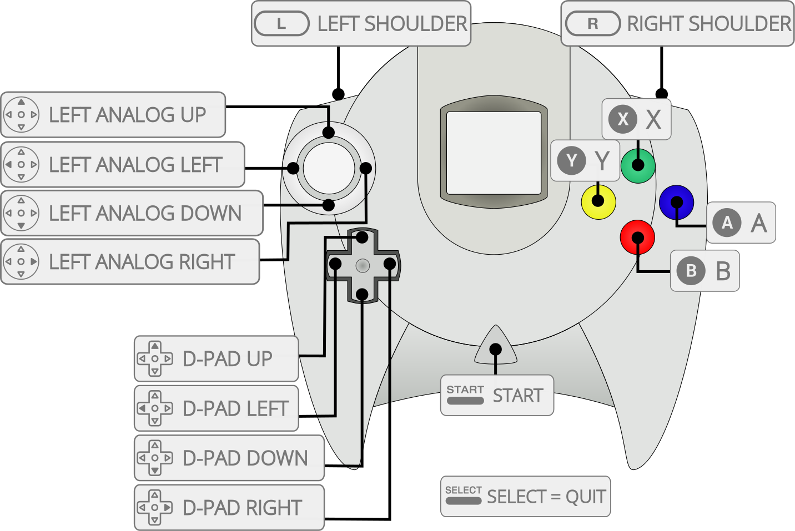

# Sega - Dreamcast (Redream)

## Background

Redream is a work-in-progress SEGA Dreamcast emulator written in C for Mac, Linux and Windows.

### Requirements

This core requires OpenGL 3.3 or higher in order to work.

RetroArch's video driver must be set to OpenGL. Go to Settings -> Driver. If the ‘video driver’ is set to something else or than 'gl', switch to ‘gl’, and then restart.

!!! attention
	There is currently no ‘working’ macOS version available. This is because this core requires OpenGL core 3.3 context, and RetroArch on macOS currently does not support this.

### Author/License

The Redream core has been authored by

- inolen

The Redream core **(libretro fork only)** is licensed under

- [GPLv3](https://github.com/libretro/redream/blob/master/LICENSE.txt)

A summary of the licenses behind RetroArch and its cores have found [here](https://docs.libretro.com/tech/licenses/).

## Extensions

Content that can be loaded by the Redream core have the following file extensions:

- .gdi
- .chd
- .cdi

## Databases

RetroArch database(s) that are associated with the Redream core:

- [Sega - Dreamcast](https://github.com/libretro/libretro-database/blob/master/rdb/Sega%20-%20Dreamcast.rdb)

## BIOS

Required or optional firmware files go in the frontend's system directory.

!!! attention
	The firmware files need to be in a directory named 'dc' in RetroArch's system directory.

| Filename        | Description                                  |              md5sum              |
|:---------------:|:--------------------------------------------:|:--------------------------------:|
| dc/dc_boot.bin  | dc_boot.bin (Dreamcast BIOS) - Required      | e10c53c2f8b90bab96ead2d368858623 |               |
| dc/dc_flash.bin | dc_flash.bin (Date/Time/Language) - Required | 0a93f7940c455905bea6e392dfde92a4 |

## Features

Frontend-level settings or features that the Redream core respects.

| Feature           | Supported |
|-------------------|:---------:|
| Restart           | ✕         |
| Screenshots       | ✔         |
| Saves             | ✔         |
| States            | ✕         |
| Rewind            | ✕         |
| Netplay           | ✕         |
| Core Options      | ✕         |
| RetroAchievements | ✕         |
| RetroArch Cheats  | ✕         |
| Native Cheats     | ✕         |
| Controls          | ✔         |
| Remapping         | ✔         |
| Multi-Mouse       | ✕         |
| Rumble            | ✕         |
| Sensors           | ✕         |
| Camera            | ✕         |
| Location          | ✕         |
| Subsystem         | ✕         |
| [Softpatching](https://docs.libretro.com/guides/softpatching/) | ✕         |
| Disk Control      | ✕         |
| Username          | ✕         |
| Language          | ✕         |
| Crop Overscan     | ✕         |
| LEDs              | ✕         |

### Directories

The Redream core's internal core name is 'redream'

The Redream core saves/loads to/from these directories.

**Frontend's System directory**

- flash.bin (???)
- vmu0.bin (VMU Slot 1 Save)
- vmu1.bin (VMU Slot 2 Save)
- vmu2.bin (VMU Slot 3 Save)
- vmu3.bin (VMU Slot 4 Save)

### Geometry and timing

- The Redream core's core provided FPS is 60
- The Redream core's core provided sample rate is 44100 Hz
- The Redream core's core provided aspect ratio is 4/3

## Controllers

The Redream core supports the following device type(s) in the controls menu, bolded device types are the default for the specified user(s):

### User 1 - 4 device types

- None - Doesn't disable input. There's no reason to switch to this.
- **RetroPad** - Joypad - Stay on this.
- RetroPad w/Analog - Same as RetroPad. There's no reason to switch to this.

### Controller tables

#### Joypad

| User 1 - 4 Remap descriptors | RetroPad Inputs                              |
|------------------------------|----------------------------------------------|
| A                            |        |
| X                            |        |
| Start                        |          |
| D-Pad Up                     |        |
| D-Pad Down                   |      |
| D-Pad Left                   |      | 
| D-Pad Right                  |     |
| B                            |        |
| Y                            |        | 
| L                            |             |
| R                            |             |
| Analog X                     |             |
| Analog Y                     |  X  |

## Compatibility

- Since Redream is a work-in-progress Dreamcast emulator, expect sound issues, general compatibility issues, and a general rough experience.

## External Links

- [Libretro Redream Core info file](https://github.com/libretro/libretro-super/blob/master/dist/info/redream_libretro.info)
- [Libretro Redream Github Repository](https://github.com/libretro/redream)
- [Report Libretro Redream Core Issues Here](https://github.com/libretro/redream/issues)

### See also

#### Sega - Dreamcast

- [Sega - Dreamcast (Reicast)](https://docs.libretro.com/library/reicast/)